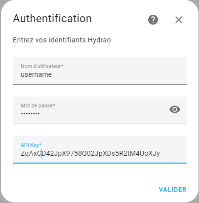

# Hydrao pour Home Assistant
Intégration pour remonter les informations de ces pommeaux de douches Hydrao dans Home Assistant.

## Installation

Utilisez [hacs](https://hacs.xyz/).

## Configuration

### Obtenir une clé d'API

- Faire une demande de clé d'API à Hydrao en utilisant leur [formulaire de support](https://www.hydrao.com/fr/besoin-d-aide-/sav).

### Configuration dans Home Assistant

La méthode de configuration consiste à utiliser l'interface utilisateur.

Il faut tout d'abord saisir ces [identifiants d'accés](#obtenir-une-clé-dapi) à l'API.

En cas de d'installation avec plusieurs pommeaux disponible, une sélection du (des) dispositif(s) est possible.

> **Note**
> Les données sont issues des serveurs Hydrao via leur API. Cette intégration ne se connecte pas aux pommeaux, et ne se substitue pas au téléphone ou la passerelle Hydrao.

### Données

Les données affichées sont  :

- Volume moyen en L
- Volume total en L
- Nombre de douche
- Tendance en %
